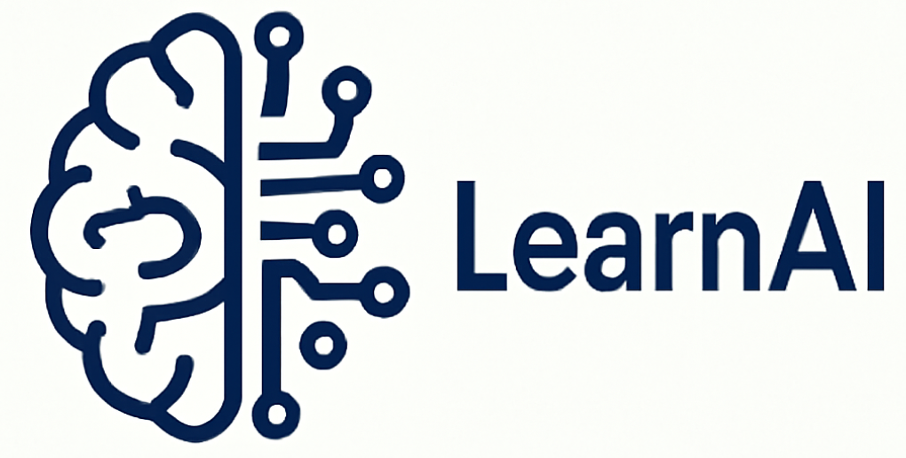

# LearnAI 项目

<p align="center">
    
</p>

## 项目简介
LearnAI 是一个用于学习和开发人工智能应用的项目。它包含多个模块和工具，旨在帮助开发者快速构建和测试 AI 模型。

## 目录结构
```
LearnAI/
├── README.md
├── langgraph.json
├── main.py
├── pyproject.toml
├── src/
│   └── agent/
│       ├── __init__.py
│       ├── my_agent.py
│       ├── utils/
│       └── webapp.py
├── test/
└── uv.lock
```

## 安装指南
1. 克隆项目到本地：
   ```bash
   git clone <repository-url>
   ```
2. 进入项目目录并安装依赖：
   ```bash
   cd LearnAI
   uv sync
   ```

## 使用说明
- cli运行主程序：
  ```bash
  langgraph dev --allow-blocking
  ```
- 配置文件位于 `langgraph.json`，可以根据需要进行修改。

## 贡献
欢迎贡献代码！请 fork 本项目并提交 pull request。
